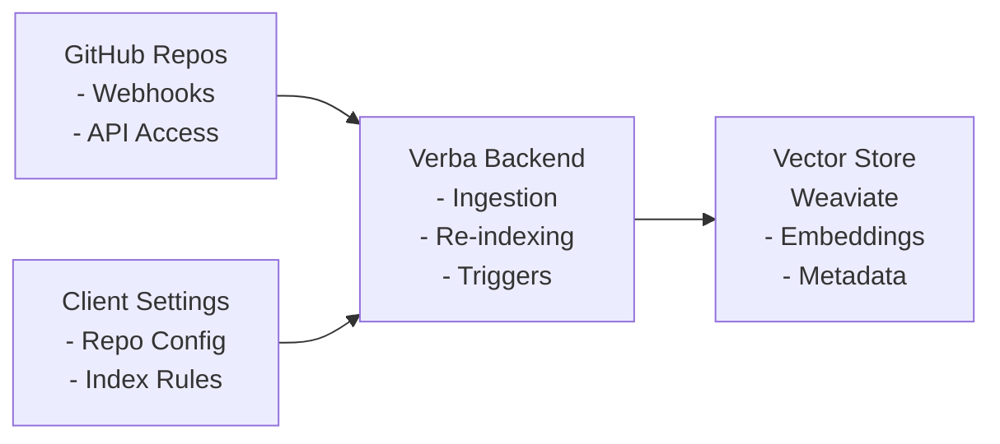

# Development Guide: GitHub Repository Integration for Verba

## Overview

This guide helps developers customize Verba to integrate multiple GitHub repositories as data sources for the RAG system. The integration supports automatic re-indexing through webhook triggers and can be configured from the client settings.

## Architecture Overview



## Quick Start

### 1. Environment Setup

```bash
# Clone Verba repository
git clone https://github.com/weaviate/Verba.git
cd Verba

# Install dependencies
pip install -e .

# Set up environment variables
cp .env.example .env
# Edit .env with your configurations:
# GITHUB_ACCESS_TOKEN=ghp_xxxxxxxxxxxx
# GITHUB_WEBHOOK_SECRET=your_webhook_secret
# OPENAI_API_KEY=sk-xxxxxxxxxxxx
# WEAVIATE_URL=http://localhost:8080
```

### 2. Create GitHub Repository Reader

Create a new reader component for GitHub repositories:

```python
# goldenverba/components/reader/GitHubReader.py
from goldenverba.components.interfaces import Reader
from goldenverba.components.document import Document
from goldenverba.components.types import InputConfig
import git
import os
from typing import List

class GitHubReader(Reader):
    """Reader for GitHub repositories"""
  
    def __init__(self):
        super().__init__()
        self.name = "GitHubReader"
        self.description = "Reads and indexes GitHub repository contents"
        self.requires_env = ["GITHUB_ACCESS_TOKEN"]
  
        self.config = {
            "Repository URL": InputConfig(
                type="text",
                value="",
                description="GitHub repository URL",
                values=[],
            ),
            "Branch": InputConfig(
                type="text",
                value="main",
                description="Branch to index",
                values=[],
            ),
            "File Patterns": InputConfig(
                type="textarea",
                value="*.md\n*.py\n*.js\n*.tsx",
                description="File patterns to include (one per line)",
                values=[],
            ),
            "Exclude Patterns": InputConfig(
                type="textarea",
                value="node_modules/\n.git/\ntest/\n*.test.*",
                description="Patterns to exclude (one per line)",
                values=[],
            ),
        }
  
    async def read(self, config: dict) -> List[Document]:
        """Read repository and create documents"""
        repo_url = config["Repository URL"].value
        branch = config["Branch"].value
  
        # Clone or update repository
        repo_path = await self.clone_or_update_repo(repo_url, branch)
  
        # Get files based on patterns
        files = self.get_matching_files(
            repo_path,
            config["File Patterns"].value.split('\n'),
            config["Exclude Patterns"].value.split('\n')
        )
  
        documents = []
        for file_path in files:
            doc = await self.create_document_from_file(file_path, repo_url)
            documents.append(doc)
  
        return documents
  
    async def clone_or_update_repo(self, repo_url: str, branch: str) -> str:
        """Clone repository or update if exists"""
        # Implementation for cloning/updating repo
        pass
  
    def get_matching_files(self, repo_path: str, include: List[str], exclude: List[str]) -> List[str]:
        """Get files matching patterns"""
        # Implementation for file pattern matching
        pass
  
    async def create_document_from_file(self, file_path: str, repo_url: str) -> Document:
        """Create Verba document from file"""
        # Implementation for document creation
        pass
```

### 3. Register the Reader

Add your reader to the component managers:

```python
# goldenverba/components/managers.py
from goldenverba.components.reader.GitHubReader import GitHubReader

readers = [
    SimpleReader(),
    PDFReader(),
    GitHubReader(),  # Add your GitHub reader
    # ...existing readers...
]
```

### 4. Implement Re-indexing Endpoint

Add the re-indexing endpoint to the API:

```python
# goldenverba/server/api.py
from fastapi import BackgroundTasks, Body
from typing import List, Dict
import uuid

@app.post("/api/reindex/github")
async def reindex_github_repos(
    repos: List[Dict[str, str]],
    background_tasks: BackgroundTasks,
    config: dict = Body(...)
):
    """
    Trigger re-indexing of GitHub repositories
  
    Args:
        repos: List of repository configurations
        config: RAG pipeline configuration
    """
    job_id = str(uuid.uuid4())
  
    # Add to background tasks
    background_tasks.add_task(	
        process_github_reindex,
        job_id,
        repos,
        config,
        verba_manager
    )
  
    return {
        "status": "accepted",
        "job_id": job_id,
        "message": f"Re-indexing {len(repos)} repositories"
    }

async def process_github_reindex(
    job_id: str,
    repos: List[Dict[str, str]],
    config: dict,
    verba_manager: VerbaManager
):
    """Background task for repository re-indexing"""
  
    for repo in repos:
        try:
            # Use GitHubReader to read repository
            reader = GitHubReader()
            documents = await reader.read(repo)
      
            # Process through RAG pipeline (see RAG_DEV.md for details)
            # The actual chunking, embedding, and storage implementation
            # is handled by the RAG system components
      
            # Update status
            await update_job_status(job_id, f"Completed {repo['url']}")
      
        except Exception as e:
            await update_job_status(job_id, f"Failed {repo['url']}: {str(e)}", error=True)
```

### 5. Configure Client Settings

Update the frontend to allow repository configuration:

```javascript
// frontend/src/components/Settings/GitHubSettings.tsx
import React, { useState } from 'react';

const GitHubSettings = () => {
    const [repos, setRepos] = useState([]);
    const [newRepo, setNewRepo] = useState({
        url: '',
        branch: 'main',
        autoIndex: true,
        filePatterns: ['*.md', '*.py'],
    });
  
    const addRepository = () => {
        // Add repository to configuration
        setRepos([...repos, newRepo]);
        // Save to backend
        saveRepoConfiguration(newRepo);
    };
  
    const triggerReindex = async (repoUrl) => {
        const response = await fetch('/api/reindex/github', {
            method: 'POST',
            headers: { 'Content-Type': 'application/json' },
            body: JSON.stringify({
                repos: [{ url: repoUrl }],
                config: {
                    // RAG pipeline configuration
                    // See RAG_DEV.md for available options
                }
            })
        });
  
        const result = await response.json();
        console.log('Re-indexing started:', result.job_id);
    };
  
    return (
        <div>
            <h3>GitHub Repository Configuration</h3>
            {/* Repository configuration UI */}
        </div>
    );
};
```

## GitHub Integration Features

### Multiple Repository Management

```python
# goldenverba/components/managers.py
class GitHubRepositoryManager:
    """Manage multiple GitHub repositories"""
  
    def __init__(self):
        self.repositories = {}
        self.indexing_queue = asyncio.Queue()
  
    async def add_repository(self, repo_config: dict):
        """Add a repository to be managed"""
        repo_id = self.generate_repo_id(repo_config["url"])
        self.repositories[repo_id] = {
            "config": repo_config,
            "last_indexed": None,
            "status": "pending"
        }
  
    async def remove_repository(self, repo_url: str):
        """Remove a repository from management"""
        repo_id = self.generate_repo_id(repo_url)
        if repo_id in self.repositories:
            # Remove from Weaviate
            await self.remove_repo_documents(repo_id)
            del self.repositories[repo_id]
  
    async def schedule_reindex(self, repo_url: str):
        """Schedule a repository for re-indexing"""
        await self.indexing_queue.put(repo_url)
  
    async def process_indexing_queue(self):
        """Process repositories in the indexing queue"""
        while True:
            repo_url = await self.indexing_queue.get()
            await self.index_repository(repo_url)
```

### Webhook Security

```python
# goldenverba/server/webhooks.py
import hmac
import hashlib
from fastapi import Request, HTTPException

async def verify_github_webhook(request: Request) -> dict:
    """Verify and process GitHub webhook"""
  
    # Get signature from headers
    signature = request.headers.get("X-Hub-Signature-256")
    if not signature:
        raise HTTPException(status_code=401, detail="No signature provided")
  
    # Verify signature
    body = await request.body()
    secret = os.environ.get("GITHUB_WEBHOOK_SECRET").encode()
    expected_sig = "sha256=" + hmac.new(secret, body, hashlib.sha256).hexdigest()
  
    if not hmac.compare_digest(expected_sig, signature):
        raise HTTPException(status_code=401, detail="Invalid signature")
  
    # Parse webhook payload
    payload = await request.json()
    return payload

@app.post("/api/webhooks/github")
async def handle_github_webhook(
    request: Request,
    background_tasks: BackgroundTasks
):
    """Handle GitHub webhook events"""
  
    payload = await verify_github_webhook(request)
    event_type = request.headers.get("X-GitHub-Event")
  
    if event_type == "push":
        # Handle push event - trigger re-indexing
        repo_url = payload["repository"]["clone_url"]
        changed_files = extract_changed_files(payload)
  
        background_tasks.add_task(
            incremental_reindex,
            repo_url,
            changed_files
        )
  
        return {"status": "accepted", "event": event_type}
  
    return {"status": "ignored", "event": event_type}
```

## Testing Your Integration

### Unit Tests

```python
# tests/test_github_integration.py
import pytest
from goldenverba.components.reader.GitHubReader import GitHubReader

class TestGitHubIntegration:
    @pytest.fixture
    def github_reader(self):
        return GitHubReader()
  
    @pytest.mark.asyncio
    async def test_read_repository(self, github_reader):
        config = {
            "Repository URL": {"value": "https://github.com/test/repo"},
            "Branch": {"value": "main"},
            "File Patterns": {"value": "*.md"},
        }
  
        documents = await github_reader.read(config)
        assert len(documents) > 0
        assert all(doc.extension == ".md" for doc in documents)
  
    @pytest.mark.asyncio
    async def test_reindex_endpoint(self, client):
        response = await client.post("/api/reindex/github", json={
            "repos": [{"url": "https://github.com/test/repo"}],
            "config": {"pipeline": "default"}
        })
  
        assert response.status_code == 200
        assert "job_id" in response.json()
```

### Integration Tests

```python
# tests/integration/test_github_rag_pipeline.py
class TestGitHubRAGPipeline:
    @pytest.mark.asyncio
    async def test_full_pipeline(self, verba_manager):
        """Test complete pipeline from GitHub to query"""
  
        # 1. Index a repository
        await verba_manager.index_github_repo("https://github.com/test/docs")
  
        # 2. Query the indexed content
        results = await verba_manager.query("How do I install the package?")
  
        assert len(results) > 0
        assert "installation" in results[0].content.lower()
```

## Deployment Considerations

### Production Configuration

```yaml
# docker-compose.yml
version: '3.8'
services:
  verba:
    image: verba:latest
    environment:
      - GITHUB_ACCESS_TOKEN=${GITHUB_ACCESS_TOKEN}
      - GITHUB_WEBHOOK_SECRET=${GITHUB_WEBHOOK_SECRET}
      - WEAVIATE_URL=http://weaviate:8080
      - REDIS_URL=redis://redis:6379  # For job queue
    ports:
      - "8000:8000"
    volumes:
      - ./repos:/app/repos  # Cache cloned repositories
  
  weaviate:
    image: semitechnologies/weaviate:latest
    environment:
      - PERSISTENCE_DATA_PATH=/var/lib/weaviate
    volumes:
      - weaviate_data:/var/lib/weaviate
  
  redis:
    image: redis:alpine
    volumes:
      - redis_data:/data

volumes:
  weaviate_data:
  redis_data:
```

### Scaling Considerations

1. **Repository Caching**: Cache cloned repositories to avoid repeated cloning
2. **Incremental Updates**: Only re-index changed files when possible
3. **Batch Processing**: Process multiple repositories in parallel
4. **Rate Limiting**: Respect GitHub API rate limits
5. **Queue Management**: Use job queues for large-scale indexing

## Troubleshooting

### Common Issues

1. **GitHub Authentication Failures**

   - Verify `GITHUB_ACCESS_TOKEN` is set correctly
   - Check token permissions (repo read access required)
2. **Webhook Not Triggering**

   - Verify webhook URL is publicly accessible
   - Check webhook secret matches configuration
   - Review GitHub webhook delivery logs
3. **Large Repository Timeout**

   - Implement chunked processing for large repos
   - Increase timeout settings
   - Use background job processing
4. **Memory Issues with Large Files**

   - Implement streaming for large files
   - Set maximum file size limits
   - Use file filtering to exclude large binaries

## Next Steps

1. Review [ADDITIONAL_API_TRIGGER.md](./ADDITIONAL_API_TRIGGER.md) for detailed API endpoint documentation
2. Check [RAG_DEV.md](./RAG_DEV.md) for customizing the RAG pipeline components
3. Join the Verba community for support and contributions

---

*For more information, see the [Verba documentation](https://github.com/weaviate/Verba)*

1. **Repository Caching**: Cache cloned repositories to avoid repeated cloning
2. **Incremental Updates**: Only re-index changed files when possible
3. **Batch Processing**: Process multiple repositories in parallel
4. **Rate Limiting**: Respect GitHub API rate limits
5. **Queue Management**: Use job queues for large-scale indexing

## Troubleshooting

### Common Issues

1. **GitHub Authentication Failures**

   - Verify `GITHUB_ACCESS_TOKEN` is set correctly
   - Check token permissions (repo read access required)
2. **Webhook Not Triggering**

   - Verify webhook URL is publicly accessible
   - Check webhook secret matches configuration
   - Review GitHub webhook delivery logs
3. **Large Repository Timeout**

   - Implement chunked processing for large repos
   - Increase timeout settings
   - Use background job processing
4. **Memory Issues with Large Files**

   - Implement streaming for large files
   - Set maximum file size limits
   - Use file filtering to exclude large binaries

## Next Steps

1. Review [ADDITIONAL_API_TRIGGER.md](./ADDITIONAL_API_TRIGGER.md) for detailed API documentation
2. Check [RAG_DEV.md](./RAG_DEV.md) for complete RAG customization guide
3. See [CUSTOMIZATION.md](./CUSTOMIZATION.md) for empty document handling and graceful degradation patterns
4. Join the Verba community for support and contributions

## Recent Enhancements

### Empty Document Handling (v2.1.3+)

Verba now includes robust handling for scenarios with empty or no matching documents:

- **Backend**: Enhanced `managers.py` with collection count checks and null safety
- **Frontend**: Improved `ChatInterface.tsx` to continue generation without retrieved context
- **API**: Updated endpoints to log empty results as informational rather than errors
- **RAG Pipeline**: Graceful degradation allowing AI generation even without document context

For complete implementation details, see [CUSTOMIZATION.md](./CUSTOMIZATION.md).

**Benefits:**

- Better user experience for new installations
- Professional handling of empty knowledge bases
- Continued AI assistance even without relevant documents
- Robust error handling throughout the RAG pipeline

---

*For more information, see the [Verba documentation](https://github.com/weaviate/Verba)*
