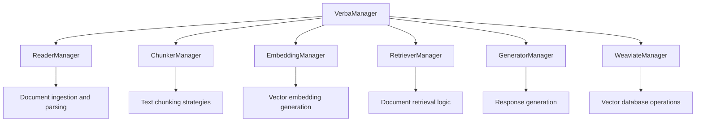

# RAG Development Guide for Verba

## Table of Contents
1. [Overview](#overview)
2. [Quick Reference](#quick-reference)
3. [Architecture](#architecture)
4. [Chunking and Indexing Customization](#chunking-and-indexing-customization)
5. [Retrieval System Customization](#retrieval-system-customization)
6. [Continuous Chat Memory and Related Components](#continuous-chat-memory-and-related-components)
7. [Vector Database Integration](#vector-database-integration)
8. [Component Development Guidelines](#component-development-guidelines)
9. [Testing and Best Practices](#testing-and-best-practices)
10. [Troubleshooting](#troubleshooting)

## Overview

Verba's RAG (Retrieval-Augmented Generation) system is built on a modular architecture that allows developers to customize and extend various components. This guide provides comprehensive instructions for contributing to and customizing the RAG system, focusing on three main areas:

1. **Chunking and Indexing**: How documents are split and prepared for vector storage
2. **Retrieval System**: How relevant chunks are found and retrieved
3. **Chat Memory**: How conversations are maintained and context is preserved

## Quick Reference

### Core Component Interfaces

#### Chunker Interface
```python
class YourChunker(Chunker):
    async def chunk(self, config: dict, documents: list[Document], 
                   embedder: Embedding | None = None, 
                   embedder_config: dict | None = None) -> list[Document]:
        # Implementation here
        pass
```

#### Retriever Interface  
```python
class YourRetriever(Retriever):
    async def retrieve(self, client, query: str, vector: list[float], 
                      config: dict, weaviate_manager: WeaviateManager,
                      labels: list[str] = [], document_uuids: list[str] = []):
        # Implementation here
        pass
```

#### Generator Interface
```python
class YourGenerator(Generator):
    def prepare_messages(self, query: str, context: str, 
                        conversation: list[dict] = None) -> list[dict]:
        # Implementation here
        pass
        
    async def generate_stream(self, config: dict, query: str, 
                             context: str, conversation: list[dict]):
        # Implementation here
        pass
```

### Key File Locations

- **Component Interfaces**: `goldenverba/components/interfaces.py`
- **Component Managers**: `goldenverba/components/managers.py`
- **Main RAG Logic**: `goldenverba/verba_manager.py`
- **Chunkers**: `goldenverba/components/chunking/`
- **Retrievers**: `goldenverba/components/retriever/`
- **Generators**: `goldenverba/components/generation/`
- **Embedders**: `goldenverba/components/embedding/`

### Registration Pattern

1. Create your component in the appropriate directory
2. Import it in `goldenverba/components/managers.py`
3. Add to the respective list (chunkers, retrievers, generators, etc.)

```python
# In managers.py
from goldenverba.components.chunking.YourChunker import YourChunker

chunkers = [
    TokenChunker(),
    SentenceChunker(),
    YourChunker(),  # Add here
]
```

### Configuration Schema

```python
self.config = {
    "Parameter Name": InputConfig(
        type="dropdown|number|text|textarea|password|multi",
        value="default_value",
        description="User-friendly description",
        values=["list", "of", "options"],  # For dropdown/multi
    ),
}
```

## Architecture

### Core Components

Verba's RAG system consists of five primary component types, each managed by dedicated managers:



### Component Interface Pattern

All components inherit from the base `VerbaComponent` class and implement specific interfaces:

```python
class VerbaComponent:
    def __init__(self):
        self.name = ""
        self.requires_env = []      # Required environment variables
        self.requires_library = []   # Required Python libraries
        self.description = ""
        self.config = {}            # Component configuration schema
        self.type = ""
```

## Memory Management Patterns

#### Sliding Window
```python
def sliding_window_memory(self, conversation: list[dict], window_size: int):
    return conversation[-(window_size * 2):]  # Keep last N exchanges
```

#### Context Truncation
```python
def truncate_to_token_limit(self, text: str, max_tokens: int):
    estimated_tokens = len(text) // 4  # ~4 chars per token
    if estimated_tokens > max_tokens:
        char_limit = max_tokens * 4
        return text[:char_limit]
    return text
```

## Vector Database Operations

### Weaviate Search
```python
collection = client.collections.get("Verba")
response = collection.query.near_vector(
    near_vector=query_vector,
    limit=limit,
    where=filters,
    return_metadata=MetadataQuery(score=True)
)
```

### Metadata Filtering
```python
label_filter = Filter.by_property("doc_labels").contains_any(labels)
uuid_filter = Filter.by_property("doc_uuid").contains_any(document_uuids)
combined_filter = label_filter & uuid_filter
```

## Testing Patterns

```python
import pytest
from goldenverba.components.document import Document

class TestYourComponent:
    @pytest.fixture
    def component(self):
        return YourComponent()
    
    @pytest.mark.asyncio
    async def test_functionality(self, component):
        # Test implementation
        pass
```

## Common Troubleshooting

1. **Component not loading**: Check imports in `managers.py`
2. **Config errors**: Validate `InputConfig` definitions  
3. **Vector issues**: Verify dimensions and content
4. **Memory issues**: Implement batch processing
5. **Connection issues**: Check Weaviate credentials

---

*This documentation focuses on RAG system development. For GitHub integration specifics, see [DEVELOPMENT.md](./DEVELOPMENT.md) and for API triggers, see [ADDITIONAL_API_TRIGGER.md](./ADDITIONAL_API_TRIGGER.md).*